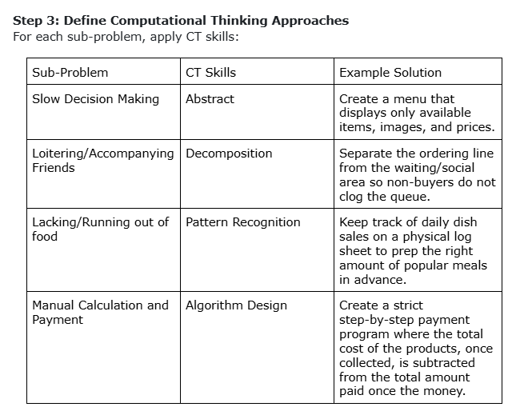

   
Annex A
Computational Thinking Exercise: "Smart School Canteen Queue"

Section: 9-Arayat                                     Score:____________
C# / Name: #19, #20, #21                              Date: 08/12/26              
Scenario

The PSHS school canteen is small and often gets crowded during lunch break. Students line up to buy food, but the process is slow because:
Some students take too long to decide what to order.

The cashier has to manually calculate totals and give change.
There is no system to track which food items are running out.
Your group’s task is to decompose this problem into smaller, manageable parts that could be solved with computational thinking (CT) Skills.

Step 1: Identify the Big Problem
Main Problem: The school canteen experiences long lines, severe crowding, and slow service.

Step 2: Identify three to four Sub-Problems
Please list possible sub-problems:
1. Slow decision-making by students.
2. Tag-alongs or line riders who do not actually want to order.
3. The food provided may be lacking.
4. Time taken to manage the price totals and change may be long.

Step 3: Define Computational Thinking Approaches 
For each sub-problem, apply CT skills:

Step 4: Draw a flowchart or write a pseudocode for the identified sub-problem
Chosen Problem: Sub-problem 1

START 
   Display "Today's Menu (Main Dishes & Prices)" 
   Student approaches menu board 

REPEAT 
    Student reads menu items and prices 
    Student selects desired item 

Display “Are you sure about your order?”
Input student_decision (yes/no)

UNTIL student_decision == “yes”

Display “Decision finalized, proceed to queue.”
Student enters the queue line ready to order
END
